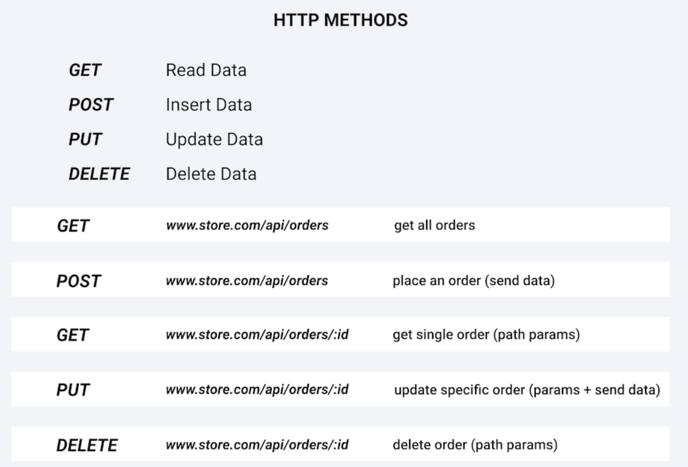

## This Repo contains notes and code of John Smilga's Express Tutorial

- Created: June 5, 2023 9:38 PM
- Created By: Keshav Carpenter
- Date: June 5, 2023
- Status: In Review 👀
- Type: Dev
- Tool : Notion

# HTTP Basic

```jsx
const http = require('http')

const server = http.createServer((req, res) => {
  // console.log(req.method)  // GET
  const url = req.url
  // home page
  if (url === '/') {
  // in header the first arg is status code and second is an object
    res.writeHead(200, { 'content-type': 'text/html' })
    res.write('<h1>home page</h1>')
/**
`You can also mention the response content inside the res.end() or can use res.write()
method. Although it's mandatory to use res.end() to end the response.`
**/
  // res.end('<h1>home page</h1>')) 
    res.end()
  }
  // about page
  else if (url === '/about') {
    res.writeHead(200, { 'content-type': 'text/html' })
    res.write('<h1>about page</h1>')
    res.end()
  }
  // 404
  else {
    res.writeHead(404, { 'content-type': 'text/html' })
    res.write('<h1>page not found</h1>')
    res.end()
  }
})

server.listen(5000)
```

[MIME types (IANA media types) - HTTP | MDN](https://developer.mozilla.org/en-US/docs/Web/HTTP/Basics_of_HTTP/MIME_types#important_mime_types_for_web_developers)

### Sending HTML files in `res.send()`

```jsx
const http = require('http')
const { readFileSync } = require('fs')

// get all files
/*
We are using readFileSync instead of async because these are the set of file which we 
will require everytime. It's not like when a client will request then only we will read 
these files. We want to read them as we start our server.
*/

/*
 The browser automatically make GET request to the server whenever it require any static
resource, so in our case we will need to manually write the case for each individual
files.
*/
const homePage = readFileSync('./navbar-app/index.html')
const homeStyles = readFileSync('./navbar-app/styles.css')
const homeImage = readFileSync('./navbar-app/logo.svg')
const homeLogic = readFileSync('./navbar-app/browser-app.js')

const server = http.createServer((req, res) => {
  // console.log(req.method)
  const url = req.url
  console.log(url)
  // home page
  if (url === '/') {
    res.writeHead(200, { 'content-type': 'text/html' })
    res.write(homePage)
    res.end()
  }
  // about page
  else if (url === '/about') {
    res.writeHead(200, { 'content-type': 'text/html' })
    res.write('<h1>about page</h1>')
    res.end()
  }
  // styles
  else if (url === '/styles.css') {
    res.writeHead(200, { 'content-type': 'text/css' })
    res.write(homeStyles)
    res.end()
  }
  // image/logo
  else if (url === '/logo.svg') {
    res.writeHead(200, { 'content-type': 'image/svg+xml' })
    res.write(homeImage)
    res.end()
  }
  // logic
  else if (url === '/browser-app.js') {
    res.writeHead(200, { 'content-type': 'text/javascript' })
    res.write(homeLogic)
    res.end()
  }
  // 404 error page
  else {
    res.writeHead(404, { 'content-type': 'text/html' })
    res.write('<h1>page not found</h1>')
    res.end()
  }
})

server.listen(5000)
```

# Express Basics

```jsx
const express = require('express')
const app = express()

app.get('/', (req, res) => {
  console.log('user hit the resource')
  res.status(200).send('Home Page')
})

app.get('/about', (req, res) => {
  res.status(200).send('About Page')
})
// '*' represent all other endpoints which are not defined above
app.all('*', (req, res) => {
  res.status(404).send('<h1>resource not found</h1>')
})

app.listen(5000, () => {
  console.log('server is listening on port 5000...')
})

// app.get
// app.post
// app.put
// app.delete
// app.all
// app.use
// app.listen
```

<aside>
💡 Send static files in express using static middleware
`app.use(express.static('./public'))`

</aside>

```jsx
const express = require('express')
const path = require('path')

const app = express()

// setup static and middleware
// put all the static files which we want to send to the client by default inside the 
// public folder
app.use(express.static('./public'))

app.get('/', (req, res) => {
  res.sendFile(path.resolve(__dirname, './navbar-app/index.html'))
})

app.all('*', (req, res) => {
  res.status(404).send('resource not found')
})

app.listen(5000, () => {
  console.log('server is listening on port 5000....')
})
```

<aside>
💡 We can also keep $`*index.html`$* insise the public folder then we won’t require to write the
`’/’` endpoint get request.
So the below code is redundant in `all static`  case.
`app.get('/', (req, res) => {
  res.sendFile(path.resolve(__dirname, './navbar-app/index.html'))
})`

</aside>

## JSON Basics

[JSON mdn docs](https://developer.mozilla.org/en-US/docs/Web/JavaScript/Reference/Global_Objects/JSON)

****`res.json([body])`****

Sends a JSON response. This method sends a response (with the correct content-type) that is the parameter converted to a JSON string using [`JSON.stringify()](https://developer.mozilla.org/en-US/docs/Web/JavaScript/Reference/Global_Objects/JSON/stringify).`

The parameter can be any JSON type, including object, array, string, Boolean, number, or null, and you can also use it to convert other values to JSON.

Reference :- [express docs](https://expressjs.com/en/4x/api.html#res.json)

```jsx
res.json(null)
res.json({ user: 'tobi' })
res.status(500).json({ error: 'message' })
```

## Params query

```jsx
app.get('/api/products/:id', (req, res) => {
    const idx = data.products.findIndex((product) => product.id === parseInt(req.params.id))
  // we need to do type conversion because type id will be string
    console.log(typeof req.params.id) // string

    if (idx === -1) {
        res.status(404).json('Product not found')
        return;
    }
    res.json(data.products[idx]);
})
```

### Complex params query

```jsx
app.get('/api/products/:productID/reviews/:reviewID', (req, res) => {
    console.log(req.params);
    const productID = parseInt(req.params.productID);
    const reviewID = parseInt(req.params.reviewID);
    const product = data.products.find((product) => product.id === productID);
    const review = product.reviews.find((review) => review.reviewId === reviewID);
    console.log(product, review)
    if (product && review) {
        res.json(review);
    }
    else {
        res.status(404).json('Product or review not found');
    }
})
```

### Multiple query URL routes `req.query()`

A url query look like this:

`http://localhost:5000/api/v1/query?name=john&id=12`

[Express docs](https://expressjs.com/en/5x/api.html#req.query)

<aside>
💡 *As `req.query`’s shape is based on user-controlled input, all properties and values in this object are untrusted and should be validated before trusting.*

</aside>

When [query parser](https://expressjs.com/en/5x/api.html#app.settings.table) is set to disabled, it is an empty object `{}`, otherwise it is the result of the configured query parser.

```jsx
const qs = require('qs')
app.setting('query parser',
  (str) => qs.parse(str, { /* custom options */ }))
```

```jsx
//example url : http://localhost:5000/api/v1/query?search=a&limit=2
app.get('/api/v1/query', (req, res) => {
    console.log(req.query);
    const { search, limit } = req.query;
    const products = search ? data.products.filter((product) => {
        if (product.name.substring(0, search.length) === search) {
            return product;
        }
    }) : data.products;

    const limitedProducts = limit ? products.slice(0, Number(limit)) : products;
    return res.json(limitedProducts);
})
```

## Middlewares

[Express docs](https://expressjs.com/en/guide/writing-middleware.html)

***Middleware*** functions are functions that have access to the [request object](https://expressjs.com/en/4x/api.html#req) (`req`), the [response object](https://expressjs.com/en/4x/api.html#res) (`res`), and the `next` function in the application’s request-response cycle. The `next` function is a function in the Express router which, when invoked, executes the middleware succeeding the current middleware.

<aside>
💡 If the current middleware function does not end the request-response cycle, it must call `next()` to pass control to the next middleware function. Otherwise, the request will be left hanging.

</aside>

```jsx
const logger = (req, res, next) => {
  const method = req.method
  const url = req.url
  const time = new Date().getFullYear()
  console.log(method, url, time)
 //res.send('Testing')
 // if we are not terminating the req-res cycle by sending the res then we must call 
 // the next() function which invoke next middleware
  next()
}
app.get('/', logger, (req, res) => {
  res.send('Home')
})
app.get('/about', logger, (req, res) => {
  res.send('About')
})
//for multiple middleware we can pass them as array
app.get('/api', [logger,authorize], (req, res) => {
  res.send('About')
})
```

<aside>
💡 To use a particular middleware with all the routes we can use `app.use()` method. We can create a separate `js` file for each custom middleware and import it in our `app.js`

</aside>

### `app.use( )` middleware

```jsx
const logger = require('./logger')
const authorize = require('./authorize')

// keep the middleware first in the array of arguments which you want to use first.
app.use([logger, authorize])

app.get('/', (req, res) => {
  res.send('Home')
})
```

The middleware function is executed when the base of the requested path matches `path`.

A route will match any path that follows its path immediately with a “`/`”. For example: `app.use('/apple', ...)` will match “/apple”, “/apple/images”, “/apple/images/news”, and so on.

```jsx
app.use('/abcd', (req, res, next) => {
 console.log('I am a middleware stuck like a sandwitch in between!')
  next()
})
app.use('/api',logger)
app.use('/api/products',[logger,authorize])
```

```jsx
const authorize = (req, res, next) => {
    const { user } = req.query;
    if (user === 'john') {
        req.user = { name: 'john', id: 3 }
    next()
    }
    else {
        res.send('Unauthorized')
    }
}
module.exports = authorize;
```

### Commonly used express middlewares

```jsx
// to serve static files 
app.use(express.static('/public'))
// to parse data from forms
app.use()
// parses JSON payloads
app.use(express.json())
// url enocding
app.use(express.urlencoded())
app.use(express.urlencoded({ extended: false }));
//Cookie-parser — Parse Cookies
app.use(cookieParser());
// Passport :- wide range of auth mechanism
// CORS — Allow or Restrict Requested Resources on a Web Server
// Helmet — Increase HTTP Header Security
```

<aside>
💡 Difference between a node moudle and express middleware ?

</aside>

A node module is a reusable block of code that can be imported and used in a Node.js application. Express middleware is a specific type of node module that intercepts incoming HTTP requests and provides additional functionality to the application, such as parsing request data or handling authentication.

<aside>
🔗 Recommended reads : A detailed guide to [express-middlewares](https://reflectoring.io/express-middleware/)
[Common middleware in express](https://blog.bitsrc.io/5-express-middleware-libraries-every-developer-should-know-94e2728f7503)

</aside>

# HTTP Methods



```jsx
const express = require('express')
const app = express()
let { people } = require('./data')

// static assets
app.use(express.static('./methods-public'))
// parse form data
app.use(express.urlencoded({ extended: false }))
// parse json
app.use(express.json())

app.get('/api/people', (req, res) => {
    res.status(200).json({ success: true, data: people })
})

app.post('/api/people', (req, res) => {
    const { name } = req.body
    if (!name) {
        return res
            .status(400)
            .json({ success: false, msg: 'please provide name value' })
    }
    res.status(201).json({ success: true, person: name })
})

app.post('/api/postman/people', (req, res) => {
    const { name } = req.body
    if (!name) {
        return res
            .status(400)
            .json({ success: false, msg: 'please provide name value' })
    }
    res.status(201).json({ success: true, data: [...people, name] })
})

app.post('/login', (req, res) => {
    const { name } = req.body
    if (name) {
        return res.status(200).send(`Welcome ${name}`)
    }

    res.status(401).send('Please Provide Credentials')
})

app.put('/api/people/:id', (req, res) => {
    const { id } = req.params
    const { name } = req.body
    console.log(id, name)
    const person = people.find((person) => person.id === Number(id))

    if (!person) {
        return res
            .status(404)
            .json({ success: false, msg: `no person with id ${id}` })
    }
    const newPeople = people.map((person) => {
        if (person.id === Number(id)) {
            person.name = name
        }
        return person
    })
    res.status(200).json({ success: true, data: newPeople })
})

app.delete('/api/people/:id', (req, res) => {
    const person = people.find((person) => person.id === Number(req.params.id))
    if (!person) {
        return res
            .status(404)
            .json({ success: false, msg: `no person with id ${req.params.id}` })
    }
    const newPeople = people.filter(
        (person) => person.id !== Number(req.params.id)
    )
    return res.status(200).json({ success: true, data: newPeople })
})

app.listen(5000, () => {
    console.log('Server is listening on port 5000....')
})
```

## Routers

```jsx
const express = require('express')
const app = express()

const peopleRouter = require('./routes/people')
const loginRouter = require('./routes/auth')

// static assets
app.use(express.static('./methods-public'))
// parse form data
app.use(express.urlencoded({ extended: false }))
// parse json
app.use(express.json())

app.use('/api/people', peopleRouter)

app.use('/login', loginRouter)

app.listen(5000, () => {
    console.log('Server is listening on port 5000....')
})
```

```jsx
const express = require('express')
const router = express.Router()

router.post('/login', (req, res) => {
    const { name } = req.body
    if (name) {
        return res.status(200).send(`Welcome ${name}`)
    }

    res.status(401).send('Please Provide Credentials')
})

module.exports = router
```

## Controllers

```jsx
const authenticate = (req, res) => {
    const { name } = req.body
    if (name) {
        return res.status(200).send(`Welcome ${name}`)
    }

    res.status(401).send('Please Provide Credentials')
}

module.exports = authenticate
```

```jsx
const express = require('express')
const router = express.Router()

const authenticate = require('../controllers/authController')

router.post('/', authenticate)

module.exports = router
```

## Another method of writing routes

```jsx
router.route('/').get(getPeople).post(createPerson)

router.route('/postman').post(createPersonPostman)

router.route('/:id').put(updatePerson).delete(deletePerson)
```
